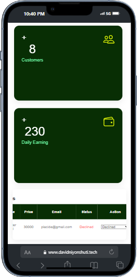

# Eco Clean Solutions

## Project Overview
Eco Clean Solutions is an innovative web application that integrates various elements learned throughout the course to create a comprehensive waste management system. The system aims to solve real world problems by enhancing waste collection, recycling, and resource management through intelligent technologies.

## Project Theme: Smart waste management system
Eco Clean Solutions enables users to manage waste collection schedules and view environmental impact metrics. The system supports three primary user roles:

- Household Users
- Waste Collection Services
- Administrators

## Features

- User Registration and Login
- Waste Collection Schedule Management
- Recycling Tracker
- Waste Collection Services Management
- Admin Dashboard

## Guidelines and Requirements

### Project Setup
- **Web Framework**: Flask
- **Database**: SQLite (Development), MySQL (Production)
- **ORM**: SQLAlchemy
- **CI/CD**: GitHub Actions

### Frontend Development
- **Technologies**: HTML, CSS, JavaScript
- **Design**: Responsive and modern UI using Bootstrap or similar CSS framework

### Backend Development
- **Framework**: Flask
- **API**: RESTful API endpoints
- **Authentication**: User authentication and authorization using Flask-Login
- **Deployment**: Docker, Nginx

## Project Structure and Functionalities

### User Registration and Login
We have implemented user registration and login functionalities using Flask-Login. This ensures secure access to the application and maintains user session management.

### Waste Collection Schedule
Household users can schedule waste collection and receive notifications. This feature ensures timely waste disposal and efficient collection routing.

### Recycling Tracker
Users can track their recycling efforts and view their environmental impact. This feature promotes recycling and provides valuable insights into the user's contributions to environmental sustainability.

### User Dashboard
Waste collection services can manage schedules and track performance through a dedicated dashboard. This feature enhances operational efficiency and service management.

### Admin Dashboard
Administrators can monitor overall system performance and manage users. The admin dashboard provides a comprehensive view of system metrics and user activities.

### Data Structures and Algorithms
We have used appropriate data structures to handle various application aspects. Additionally, we have implemented scheduling, route optimization, and data analytics algorithms to ensure optimal performance and resource utilization.

#### Testing
We have written unit tests using the Unittest module to ensure high code coverage and reliability. This practice helps maintain the integrity of the application and facilitates easier debugging and maintenance.

#### Continuous Integration and Deployment
We have set up a continuous integration and continuous deployment (CI/CD) pipeline to automatically run tests and deploy the application. The deployment is handled using Docker and Nginx, ensuring a scalable and reliable production environment.

## Running the Application Locally
1. Pull the docker image from Docker Hub
   ```bash
   sudo docker pull niyonshutidavid/ecoapp
   ```
2. Run the docker image
   ```bash
   sudo docker run -d -p 5000:5000 niyonshutidavid/ecoapp:latest
   ```
3. Accessing the Application
  You can find the web application at https://www.davidniyonshuti.tech/

## References

- **Deployed website URL**: [click here](https://www.davidniyonshuti.tech/)
- **Presentation slides**: [click here](https://www.canva.com/design/DAGIsPKIfEI/WUFDw1yQ6J9gcOHma0Fhog/edit?utm_content=DAGIsPKIfEI&utm_campaign=designshare&utm_medium=link2&utm_source=sharebutton)
- **Documentation**: [click here](https://docs.google.com/document/d/1HV_0bmPIZpB8Y3i-pi4Ok5iEeouA9PRS-_-WrtYlIhg/edit?usp=sharing)
 
## Authors
Contributors to the development of the web application:

- [David Niyonshuti](mailto:d.niyonshut@alustudent.com)
- [Daniel Iryivuze](mailto:d.iryivuze@alustudent.com)
- [Vanessa Uwonkunda](mailto:v.uwonkunda@alustudent.com)
- [Ian Ganza](mailto:i.ganza@alustudent.com)
- [Placide Kabisa Manzi](mailto:p.imanzi@alustudent.com)

## Interface
<p>
    
    
</p>
